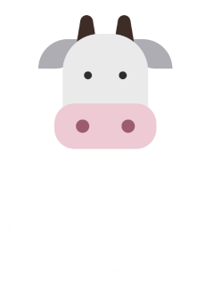

# Gobu

  

**Gobu** es un software diseñado para crear juegos de manera intuitiva y eficiente, pensado para desarrolladores de todos los niveles, desde principiantes hasta expertos.

## Filosofía del proyecto
El objetivo principal de Gobu es **simplificar el desarrollo de videojuegos**, permitiendo que los desarrolladores se concentren en la creatividad y el diseño, sin perder tiempo en configuraciones complicadas o procesos innecesarios.
