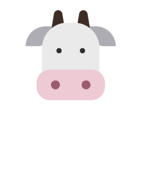

# Gobu2D

  

**Gobu** es un software diseñado para crear juegos 2D de manera intuitiva y eficiente, pensado para desarrolladores de todos los niveles, desde principiantes hasta expertos.

## Características principales
- **Facilidad de uso**: Gobu prioriza una interfaz sencilla y herramientas accesibles para que cualquier usuario pueda crear juegos sin complicaciones.
- **Herramientas integradas**: Ofrece un conjunto de herramientas potentes para diseñar niveles, gestionar entidades, animaciones, y más.
- **Soporte para diferentes resoluciones**: Compatible con múltiples resoluciones, desde retro hasta modernas, para que tus juegos luzcan como los imaginas.
- **Motor optimizado**: Diseñado para un rendimiento sobresaliente en juegos 2D.
- **Flexibilidad**: Posibilidad de personalizar aspectos clave de los juegos mediante configuraciones avanzadas.

## Filosofía del proyecto
El objetivo principal de Gobu es **simplificar el desarrollo de videojuegos 2D**, permitiendo que los desarrolladores se concentren en la creatividad y el diseño, sin perder tiempo en configuraciones complicadas o procesos innecesarios.
